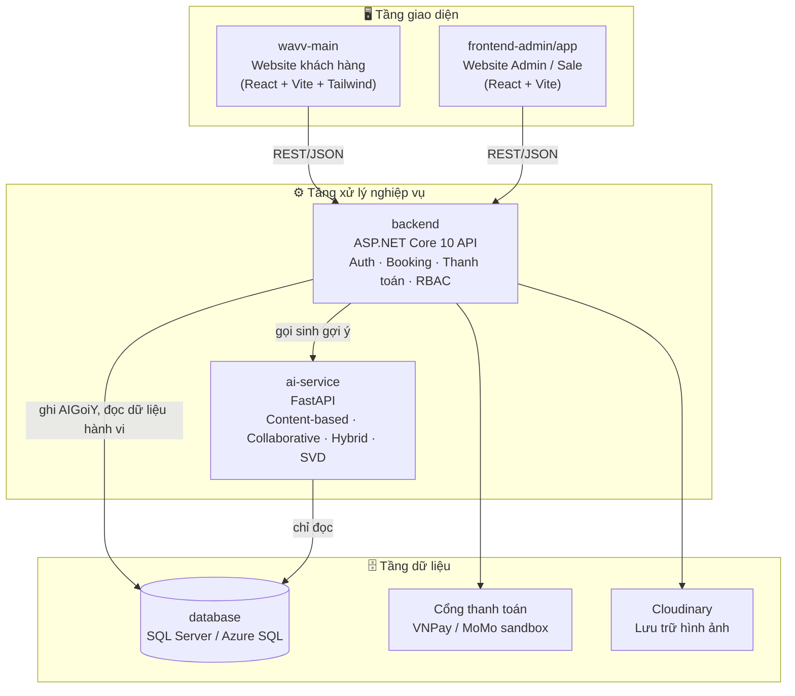

<div align="center">

# 🧭 TourDuLich — Hệ thống quản lý & cá nhân hóa trải nghiệm du lịch

**Đặt tour trực tuyến · Gợi ý cá nhân hóa bằng AI · Tự thiết kế lịch trình riêng**


</div>

---

## 📖 Mục lục

- [Giới thiệu](#-giới-thiệu)
- [Kiến trúc hệ thống](#-kiến-trúc-hệ-thống)
- [Tính năng chính](#-tính-năng-chính)
- [Công nghệ sử dụng](#-công-nghệ-sử-dụng)
- [Cấu trúc thư mục](#-cấu-trúc-thư-mục)
- [Yêu cầu môi trường](#-yêu-cầu-môi-trường)
- [Hướng dẫn cài đặt & chạy dự án](#-hướng-dẫn-cài-đặt--chạy-dự-án)
  - [1. Cơ sở dữ liệu](#1-cơ-sở-dữ-liệu)
  - [2. Backend (ASP.NET Core)](#2-backend-aspnet-core)
  - [3. AI Service (FastAPI)](#3-ai-service-fastapi)
  - [4. Website khách hàng (wavv-main)](#4-website-khách-hàng-wavv-main)
  - [5. Website Admin/Sale (frontend-admin)](#5-website-adminsale-frontend-admin)
- [Tài khoản demo](#-tài-khoản-demo)
- [Biến môi trường](#-biến-môi-trường)
- [Thuật toán gợi ý cá nhân hóa](#-thuật-toán-gợi-ý-cá-nhân-hóa)
- [Triển khai lên Azure](#-triển-khai-lên-azure)
- [Ghi chú bảo mật](#-ghi-chú-bảo-mật)

---

## 🌿 Giới thiệu

**TourDuLich** là hệ thống quản lý và bán tour du lịch trực tuyến dành cho doanh nghiệp lữ hành quy mô vừa và nhỏ. Hệ thống số hóa toàn bộ quy trình từ tìm kiếm, giữ chỗ, thanh toán cho đến khi nhân viên tiếp nhận và xử lý đơn hàng, đồng thời tích hợp một **module gợi ý cá nhân hóa** giúp khách hàng nhanh chóng tìm ra chuyến đi phù hợp thay vì phải tự so sánh thủ công giữa hàng loạt lựa chọn.

Điểm nổi bật của dự án:

- 🔎 **Gợi ý thông minh** — kết hợp lọc theo nội dung (Content-based) và lọc cộng tác (Collaborative Filtering) thành mô hình lai (Hybrid), có thêm phương án Matrix Factorization (SVD) để đối chiếu.
- 🧳 **Tự thiết kế hành trình riêng** — khách hàng nhập điểm đến, số ngày, ngân sách; hệ thống tự phác thảo tối đa 3 phương án lịch trình, nhân viên rà soát và chốt cùng khách.
- 💳 **Thanh toán mô phỏng** — hỗ trợ cổng VNPay/MoMo sandbox, đặt cọc hoặc thanh toán toàn phần, đối soát dòng tiền theo từng đơn.
- 🔐 **Phân quyền chặt chẽ** — xác thực bằng JWT, phân quyền theo vai trò (Admin / Sale / Khách hàng) và phân quyền chi tiết theo từng chức năng quản trị.

---

## 🏗️ Kiến trúc hệ thống



> Backend là **nguồn ghi duy nhất** của bảng `AIGoiY`; AI Service chỉ đọc dữ liệu qua kết nối riêng và không bao giờ ghi ngược vào database.

---

## ✨ Tính năng chính

<table>
<tr>
<th>👤 Khách hàng</th>
<th>🛠️ Quản trị / Sale</th>
</tr>
<tr valign="top">
<td>

- Đăng ký / đăng nhập
- Tìm kiếm & lọc tour, xem ưu đãi
- Xem chi tiết hành trình, lịch khởi hành
- Đặt tour, đặt cọc hoặc thanh toán toàn phần
- Theo dõi lịch sử đơn, hủy đơn
- Gửi yêu cầu **tự thiết kế tour riêng**
- Đánh giá & xem gợi ý cá nhân hóa

</td>
<td>

- Đăng nhập trang vận hành, phân quyền theo chức năng
- Quản lý danh mục tour, lịch khởi hành, sức chứa
- Duyệt đơn đặt tour theo tiến độ thanh toán
- Xử lý hoàn/hủy đơn
- Xử lý & tinh chỉnh yêu cầu thiết kế tour riêng
- Quản lý đối tác, điểm tham quan, khuyến mãi
- Quản lý tài khoản & phân quyền nhân viên
- Xem báo cáo doanh thu, trạng thái booking

</td>
</tr>
</table>

---

## 🧰 Công nghệ sử dụng

| Thành phần | Công nghệ |
|---|---|
| **Website khách hàng** | React.js, Vite, TailwindCSS, Framer Motion, Axios |
| **Website Admin/Sale** | React.js, Vite, Axios, React Router |
| **Backend API** | ASP.NET Core 10, Entity Framework, JWT, RBAC |
| **AI Service** | Python, FastAPI, scikit-learn (TF-IDF, Cosine Similarity, TruncatedSVD) |
| **Cơ sở dữ liệu** | Microsoft SQL Server / Azure SQL |
| **Thanh toán** | VNPay sandbox, MoMo sandbox |
| **Lưu trữ media** | Cloudinary |
| **Triển khai** | Azure App Service (API), Azure Static Web Apps (2 frontend) |

---

## 📁 Cấu trúc thư mục

```
DoAn_TourDuLich/
├── ai-service/           # Dịch vụ gợi ý AI (FastAPI)
│   ├── app/              # Content-based, Collaborative, Hybrid, SVD
│   ├── scripts/          # Script đánh giá offline (Precision@5 / Recall@5)
│   └── tests/
├── backend/              # ASP.NET Core Web API
│   └── src/
│       ├── TourDuLich.API/            # Controllers, DTOs, Authorization
│       ├── TourDuLich.Application/    # Services, Helpers
│       ├── TourDuLich.Domain/         # Domain models
│       ├── TourDuLich.Infrastructure/ # Entities, DbContext
│       └── TourDuLich.IntegrationTests/
├── frontend-admin/
│   └── app/              # Website Admin/Sale (React + Vite)
├── wavv-main/
│   └── client/           # Website khách hàng (React + Vite + Tailwind)
└── database/
    ├── schema/           # Script tạo schema, seed, index, view (001 → 020)
    └── rbac/             # Migration liên quan phân quyền
```

---

## 💻 Yêu cầu môi trường

| Công cụ | Phiên bản gợi ý |
|---|---|
| .NET SDK | 10.0+ |
| Node.js | 18+ |
| Python | 3.10+ |
| SQL Server / Azure SQL | 2019+ |
| ODBC Driver for SQL Server | 18 |

---

## 🚀 Hướng dẫn cài đặt & chạy dự án

> Chạy theo đúng thứ tự bên dưới: **Database → Backend → AI Service → Frontend**.

### 1. Cơ sở dữ liệu

```bash
# Mở database TourDuLich trên SQL Server / Azure SQL rồi chạy lần lượt:
001_CreateSchema.sql
002_SeedVaiTro.sql
003_SeedTestData.sql
004_Indexes.sql
005_ViewsBI.sql
006 → 020 (các migration bổ sung, chạy theo thứ tự số)
```

Chi tiết từng file xem tại [`database/schema/README.md`](database/schema/README.md). Toàn bộ tài khoản test dùng mật khẩu `Test@123456` (BCrypt hash, package `BCrypt.Net-Next 4.2.0`).

⚠️ `001_CreateSchema.sql` chỉ dành cho database **trống hoàn toàn** — không chạy trên database đã có dữ liệu thật.

### 2. Backend (ASP.NET Core)

```bash
cd backend
copy src/TourDuLich.API/appsettings.Development.json.example src/TourDuLich.API/appsettings.Development.json
# Điền ConnectionStrings, Jwt:Key, Cors:Origins, VnPay/MoMo, AiService...
dotnet run --project src/TourDuLich.API
```

Mặc định chạy tại `http://localhost:5265` / `https://localhost:7290`.

### 3. AI Service (FastAPI)

```bash
cd ai-service
python -m venv .venv
.venv\Scripts\activate        # Windows
pip install -r requirements.txt
copy .env.example .env
uvicorn app.main:app --reload --port 8000
```

`INTERNAL_API_KEY` trong `.env` phải **trùng khớp** với `AiService:ApiKey` bên backend. Kiểm tra sức khỏe dịch vụ tại `GET /health`.

```bash
# Đánh giá offline (Precision@5 / Recall@5) cho 4 thuật toán
python scripts/run_evaluation.py

# Chạy test
pytest
```

### 4. Website khách hàng (wavv-main)

```bash
cd wavv-main/client
copy .env.example .env    # VITE_API_BASE_URL=https://localhost:7290
npm install
npm run dev
```

Mặc định chạy tại `http://localhost:5173`.

### 5. Website Admin/Sale (frontend-admin)

```bash
cd frontend-admin/app
copy .env.example .env    # VITE_API_BASE_URL=https://localhost:7290
npm install
npm run dev
```

Mặc định chạy tại `http://localhost:5174`.

---

## 🔑 Tài khoản demo

Tất cả tài khoản dùng chung mật khẩu: **`Test@123456`**

| Vai trò | Số điện thoại | Đăng nhập tại |
|---|---|---|
| Admin | `0900000001` | http://localhost:5174 |
| Sale | `0900000002` | http://localhost:5174 |
| Khách hàng | `0900000003` | http://localhost:5173 |
| Khách hàng | `0900000004` | http://localhost:5173 |

---

## ⚙️ Biến môi trường

| Vị trí | Biến chính |
|---|---|
| `backend/src/TourDuLich.API/appsettings.Development.json` | `ConnectionStrings:DefaultConnection`, `Jwt:Key`, `Cors:Origins`, `VnPay:*`, `MoMo:*`, `AiService:BaseUrl`, `AiService:ApiKey` |
| `ai-service/.env` | `AI_DB_CONNECTION`, `INTERNAL_API_KEY`, `AI_CACHE_TTL_SECONDS`, `AI_REFRESH_INTERVAL_SECONDS` |
| `wavv-main/client/.env` | `VITE_API_BASE_URL` |
| `frontend-admin/app/.env` | `VITE_API_BASE_URL` |

🚫 **Không commit** connection string, mật khẩu, JWT key hay secret cổng thanh toán thật lên Git — chỉ sử dụng các file `*.env.example` làm mẫu.

---

## 🤖 Thuật toán gợi ý cá nhân hóa

AI Service cung cấp 4 chế độ tính gợi ý qua `POST /goi-y` (tham số `algorithm`):

| Chế độ | Mô tả |
|---|---|
| `content` | Content-based Filtering — mã hóa đặc trưng tour bằng TF-IDF + One-hot, so khớp bằng Cosine Similarity |
| `collaborative` | Item-based Collaborative Filtering — phân tích ma trận tương tác người dùng × hành trình |
| `hybrid` *(mặc định)* | Kết hợp có trọng số giữa hai phương pháp trên, khắc phục hạn chế "khởi động lạnh" khi dữ liệu thưa |
| `svd` | Matrix Factorization dùng `TruncatedSVD` để đối chiếu hiệu quả |

Backend chủ động làm mới bảng `AIGoiY` mỗi 300 giây (tối đa 420 giây), đảm bảo gợi ý phản ánh hành vi mới trong SLA tối đa 7 phút. Trạng thái mỗi lần chạy được ghi vào `JobRunLog`, xem tại `GET /api/ai-jobs/gan-nhat`.

---

## ☁️ Triển khai lên Azure

- **API**: 1 Azure App Service, cấu hình App Settings gồm `ConnectionStrings__DefaultConnection`, `Jwt__Key`, `Cors__Origins`, `VnPay__*`, `MoMo__*`, `AiService__*`.
- **Frontend**: 2 Azure Static Web Apps (customer & admin), mỗi bên đặt `VITE_API_BASE_URL` trỏ tới URL HTTPS public của API trước khi build.
- `Cors__Origins` cần chứa đủ 2 origin frontend, phân tách bằng dấu phẩy — thiếu origin sẽ khiến production không khởi động được.

---

## 🔒 Ghi chú bảo mật

- Không đưa connection string, mật khẩu, JWT key hay secret cổng thanh toán thật vào Git.
- AI Service chỉ có quyền **đọc** dữ liệu; mọi thao tác ghi vào `AIGoiY` đều đi qua backend để đảm bảo tính nhất quán.
- Mọi request nhạy cảm đều yêu cầu JWT hợp lệ; phân quyền theo vai trò (RBAC) chặn truy cập vượt quyền bằng mã lỗi `401`/`403`.

---

<div align="center">

Made with ☕ and 🧳 — Đồ án ngành Hệ thống thông tin quản lý

</div>
