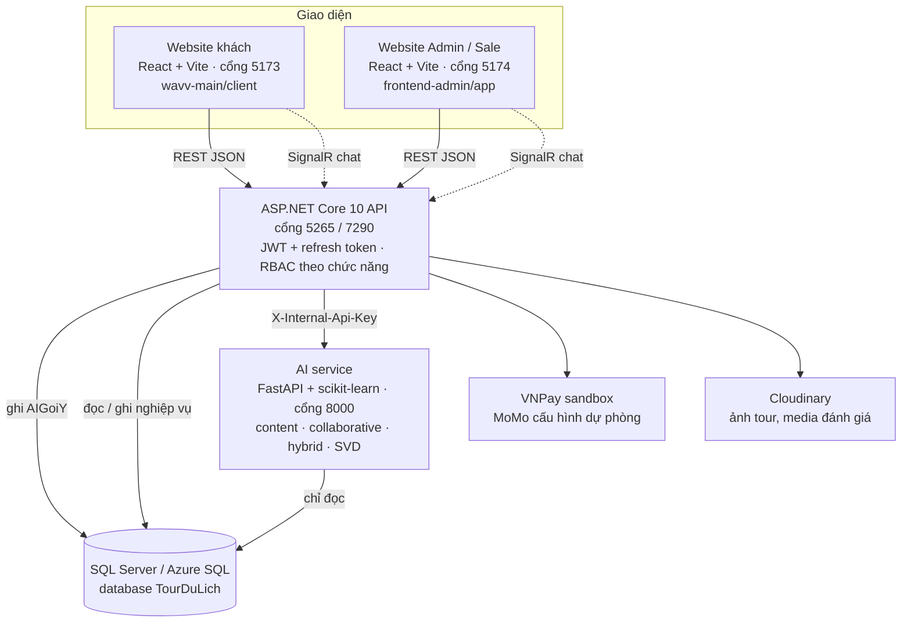

<div align="center">

# 🧭 TourDuLich

### Hệ thống quản lý tour và cá nhân hóa trải nghiệm khách hàng

[](https://github.com/Lifehealth-fresh/DoAn_TourDuLich)
[](https://github.com/Lifehealth-fresh/DoAn_TourDuLich)
[](https://github.com/Lifehealth-fresh/DoAn_TourDuLich)
[](https://github.com/Lifehealth-fresh/DoAn_TourDuLich)
[](https://github.com/Lifehealth-fresh/DoAn_TourDuLich)

**Đặt tour · Giữ chỗ · Cọc / trả đủ · Gợi ý lai · Tự thiết kế lịch trình · Duyệt hai chiều**

Đồ án ngành Hệ thống thông tin quản lý  
Trường Đại học Mở Thành phố Hồ Chí Minh · 2026

</div>

---

## Hệ thống làm được gì

Hai website độc lập, một API, một database, một dịch vụ gợi ý.

| Khách hàng | Admin / Sale |
|---|---|
| Đăng ký, đăng nhập, hồ sơ và giấy tờ | Đăng nhập trang vận hành |
| Tìm, lọc, xem chi tiết tour và lịch khởi hành | Quản lý tour, lịch, sức chứa, ảnh |
| Giữ chỗ, đặt cọc hoặc thanh toán toàn phần (VNPay sandbox) | Duyệt đơn theo số tiền đã nộp, hoàn tiền |
| Xem đơn, hủy đơn | Quản lý đối tác, điểm tham quan, ưu đãi |
| Gửi yêu cầu tự thiết kế và chọn phương án | Sửa lịch và duyệt hai chiều |
| Đánh giá sau chuyến đi (tour chuẩn công khai, tour riêng để nội bộ) | Phân quyền Thêm / Sửa / Xóa theo chức năng |
| Nhận gợi ý cá nhân hóa, chat hỗ trợ | Chat với khách, xem khách hàng |

Tài khoản demo (chỉ máy local / DB dev, mật khẩu `Test@123456`):

| Số điện thoại | Vai trò |
|---|---|
| `0900000001` | Admin |
| `0900000002` | Sale |
| `0900000003` | Khách hàng |
| `0900000004` | Khách hàng |

Trên Azure phải đổi mật khẩu các tài khoản seed ngay. Không để `Test@123456` trên môi trường public.

---

## Kiến trúc


```mermaid
flowchart TB
    subgraph web [Giao diện]
        KH["Website khách<br/>React + Vite · cổng 5173<br/>wavv-main/client"]
        AD["Website Admin / Sale<br/>React + Vite · cổng 5174<br/>frontend-admin/app"]
    end
    API["ASP.NET Core 10 API<br/>cổng 5265 / 7290<br/>JWT + refresh token · RBAC theo chức năng"]
    AI["AI service<br/>FastAPI + scikit-learn · cổng 8000<br/>content · collaborative · hybrid · SVD"]
    DB[("SQL Server / Azure SQL<br/>database TourDuLich")]
    PAY["VNPay sandbox<br/>MoMo cấu hình dự phòng"]
    FILE["Cloudinary<br/>ảnh tour, media đánh giá"]

    KH -->|REST JSON| API
    AD -->|REST JSON| API
    KH -.->|SignalR chat| API
    AD -.->|SignalR chat| API
    API -->|ghi AIGoiY| DB
    API -->|đọc / ghi nghiệp vụ| DB
    AI -->|chỉ đọc| DB
    API -->|X-Internal-Api-Key| AI
    API --> PAY
    API --> FILE
```

Luồng gợi ý: Python chỉ đọc SQL và tính điểm. ASP.NET là nơi duy nhất ghi bảng `AIGoiY` (worker làm mới, mặc định 300 giây, trần 420 giây). Khi dịch vụ AI lỗi, trang khách về danh mục mặc định.

Luồng tự thiết kế: khách gửi tỉnh đi / đến, số ngày, số khách, ngân sách. API ghép điểm tham quan, sản phẩm đối tác và ma trận thời gian nội bộ, không gọi bản đồ tính phí. Giá tour = tổng thành tiền các dòng lịch trình. Nhân viên sửa rồi gửi khách xác nhận trước khi duyệt.

---

## Cấu trúc thư mục

| Thư mục | Vai trò |
|---|---|
| `wavv-main/client` | Website khách |
| `frontend-admin/app` | Website Admin / Sale |
| `backend` | API ASP.NET Core |
| `ai-service` | Dịch vụ gợi ý |
| `database/schema` | 3 script: bảng, view, seed |

Không dùng thư mục `docs/` và `powerbi/`. View báo cáo admin (nếu còn trong script) phục vụ trang tổng quan, không gắn file Power BI.

---

## Chạy local

Cài: Node.js 20+, .NET SDK 10, Python 3.11+, SQL Server hoặc Azure SQL đã tạo database `TourDuLich`.

### 1. Database

Xem [database/README.md](database/README.md).

Với database **trống**, chạy lần lượt trong SSMS (đúng database `TourDuLich`, UTF-8):

1. `database/schema/001_TaoBang.sql`
2. `database/schema/002_TaoView.sql`
3. `database/schema/003_SeedDuLieuMau.sql`

Database **đã có dữ liệu đồ án** thì không chạy các file này.

### 2. Cấu hình

Sao chép `.env.example` và `appsettings.Development.json.example` thành file local. Không commit mật khẩu, API key, connection string.

| Biến | Ý nghĩa |
|---|---|
| Connection string API | Trỏ `TourDuLich` |
| `AiService:BaseUrl` | `http://localhost:8000/` |
| `AiService:ApiKey` | Trùng `INTERNAL_API_KEY` của Python |
| `AI_DB_CONNECTION` | Python **chỉ đọc** |
| `VnPay__*` | Sandbox VNPay |
| `Cors__Origins` | Origin của hai frontend |

Access token sống 2 giờ. Frontend tự gọi `POST /api/Auth/refresh`. Đăng xuất thu hồi refresh token.

### 3. Bốn tiến trình

```bash
# AI
cd ai-service
python -m venv .venv
# Windows: .venv\Scripts\activate
source .venv/bin/activate
pip install -r requirements.txt
copy .env.example .env
uvicorn app.main:app --reload --port 8000
```

```bash
# API
cd backend
dotnet run --project src/TourDuLich.API
```

```bash
# Khách — cổng 5173
cd wavv-main/client
npm install
npm run dev
```

```bash
# Admin — cổng 5174
cd frontend-admin/app
npm install
npm run dev -- --port 5174
```

Kiểm tra AI: `GET http://localhost:8000/health` (không cần key). `POST /goi-y` bắt buộc header `X-Internal-Api-Key`.

---

## Đóng gói trước khi nộp

`.gitignore` hiện tại đã đúng hướng. Giữ nguyên các dòng bỏ `bin/`, `obj/`, `node_modules/`, `dist/`, `.venv/`, `.env`, `appsettings.Development.json`, file chứng chỉ và file database cục bộ (`*.bak`, `*.mdf`, `*.ldf`).

Việc cần làm trên máy đang chứa repo:

```bash
git rm -r docs powerbi
git rm -r database/schema database/rbac
# rồi copy hai file mới vào:
#   README.md
#   database/README.md
#   database/schema/001_TourDuLich_Full.sql
git add README.md database
git status
```

`git status` không được thấy `node_modules`, `bin`, `obj`, `.env`, `appsettings.Development.json`, `*.docx`.

File Word báo cáo để ngoài repo (gitignore đã có `*.docx`).

---

## Azure

SQL đã có. Thêm một App Service cho API và hai Static Web Apps cho khách và admin.

App Settings: `ConnectionStrings__DefaultConnection`, `Jwt__Key`, `Cors__Origins`, `VnPay__*`, `MoMo__*`, `AiService__*`.

`Cors__Origins` là hai origin frontend, cách nhau bởi dấu phẩy. Thiếu origin thì API production không khởi động.

Mỗi frontend đặt `VITE_API_BASE_URL` bằng URL HTTPS của API **trước khi build**.

Không đưa connection string, mật khẩu, JWT key hay secret cổng thanh toán vào Git.

---

## Gợi ý AI

`POST /goi-y` nhận `algorithm`:

| Giá trị | Cách tính |
|---|---|
| `content` | Lọc theo nội dung |
| `collaborative` | Lọc cộng tác theo mục |
| `hybrid` | Mặc định, trộn hai cách trên |
| `svd` | `TruncatedSVD` |

Đánh giá offline (không ghi database):

```bash
cd ai-service
python scripts/run_evaluation.py
```

In Precision@5 và Recall@5 của bốn cấu hình.
