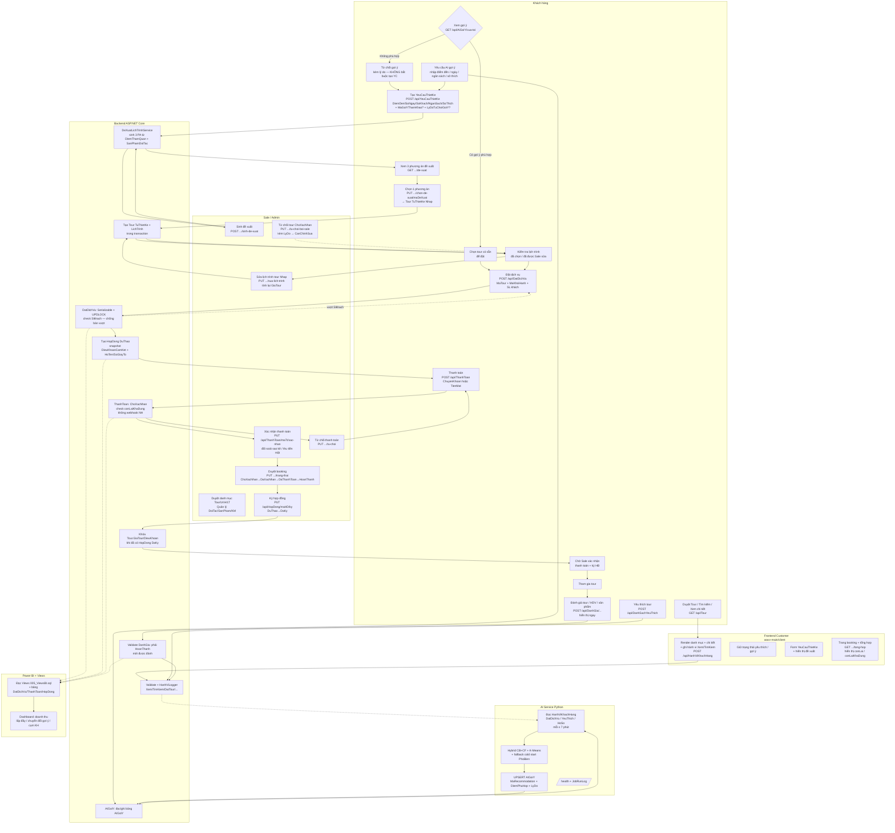
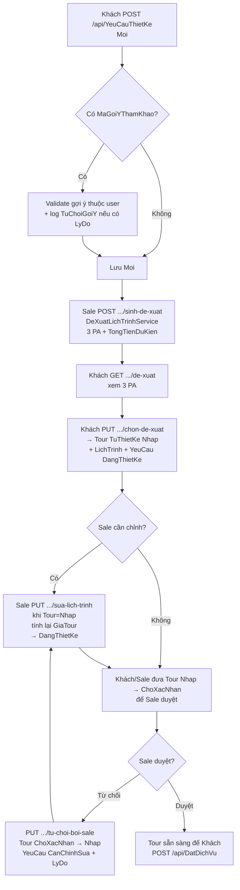
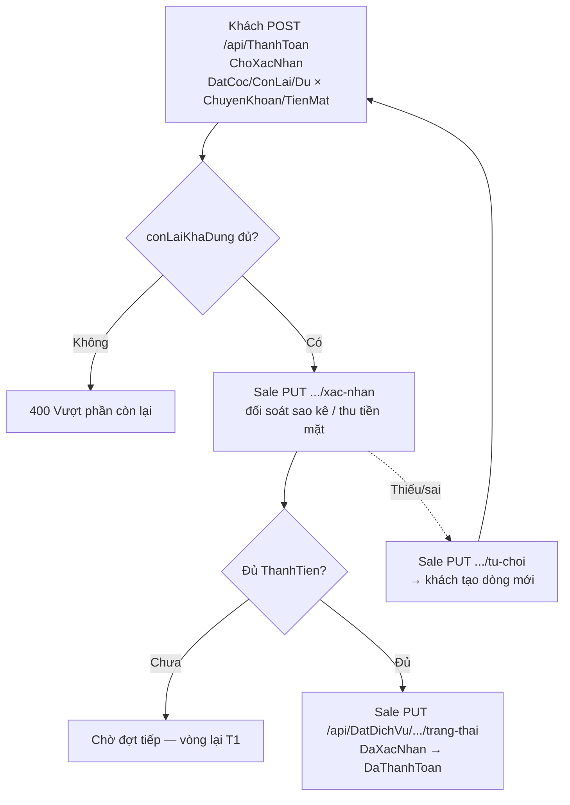

# SƠ ĐỒ NGHIỆP VỤ TỔNG THỂ — HỆ THỐNG CÁ NHÂN HÓA DU LỊCH (BPMN 2.0)

> Nguồn chân lý: code trong `D:\DoAn\DoAn_TourDuLich` (21 controller, `DeXuatLichTrinhService`, `HanhViLogger`, schema 001-009). Ký hiệu trạng thái trong sơ đồ khớp code sau Prompt 2-4. File này render trực tiếp trên GitHub (mermaid).

---

## 1. Sơ đồ tổng quan end-to-end (6 swimlane)

**Luồng đọc:**
1. Khách duyệt/tìm/yêu thích → mỗi hành động được `HanhViLogger` ghi `HanhViKhachHang` (không phụ thuộc FE).
2. Khách yêu cầu AI gợi ý → AI service (≤7 phút) đọc hành vi + booking + yêu thích → hybrid → `UPSERT AIGoiY`. Khách mới (cold start) nhận fallback `PhoBien`/`SoThichBanDau`.
3. Nếu gợi ý không phù hợp, khách có thể từ chối kèm lý do (không bắt buộc) rồi tạo `YeuCauThietKe` (có thể kèm `MaGoiYThamKhao` để AI học).
4. Sale sinh 3 phương án (`TietKiem/CanBang/CaoCap`) từ `DiemThamQuan` + `SanPhamDoiTac`; khách chọn 1 → tạo `Tour TuThietKe (Nhap)` + `LichTrinh`; Sale có thể sửa lịch trình (tính lại `GiaTour`) hoặc từ chối (`ChoXacNhan → CanChinhSua`).
5. Khách đặt (`POST /api/DatDichVu`) — backend khóa `Tour` bằng `Serializable + UPDLOCK/HOLDLOCK`, check `Slkhach` rồi mới tạo `DatDichVu ChoXacNhan` + `HopDong DuThao` snapshot `DieuKhoanCamKet`.
6. Thanh toán mock: khách tạo `ThanhToan ChoXacNhan` (`ChuyenKhoan` — chờ Sale đối soát sao kê, hoặc `TienMat` — thu tại quầy/khách sạn, có thể trả sau khi trải nghiệm lưu trú); Sale `xac-nhan → DaXacNhan` (chặn vượt `ThanhTien`). Sale duyệt booking `DaXacNhan → DaThanhToan` khi đủ tiền, ký `HopDong DuThao → DaKy` (sau đó khóa `Tour.GiaTour/DieuKhoan`).
7. Sau `HoanThanh`, khách đánh giá (tour/HDV/sản phẩm) — chỉ khi đã `HoanThanh` mới được, hiển thị ngay, vẫn ghi hành vi. Toàn bộ dữ liệu chảy vào Power BI qua views.

---

## 2. Subprocess: Tự thiết kế tour (chi tiết)

---

## 3. Subprocess: Thanh toán (rút gọn — chi tiết xem docs/QUY-TRINH-THANH-TOAN.md)

---

## 4. Chú giải trạng thái (khớp code)

- **YeuCauThietKe:** `Moi → Huy` (khách, chỉ khi `Moi`), `Moi → DangThietKe` (chọn PA), `CanChinhSua ↔ DangThietKe` (Sale từ chối / sửa).
- **Tour TuThietKe:** `Nhap → ChoXacNhan → Nhap` (từ chối) hoặc `→` sẵn sàng đặt; khóa sửa `GiaTour/DieuKhoan` khi đã có `HopDong DaKy`.
- **DatDichVu:** `ChoXacNhan → DaXacNhan → DaThanhToan → HoanThanh`, nhánh `→ DaHuy` từ `ChoXacNhan/DaXacNhan` (kèm `TyLePhatHuy/SoTienPhatHuy` theo số ngày còn lại).
- **HopDong:** `DuThao → DaKy` (Sale ký), snapshot `DieuKhoanCamKet/HoTen/SoGiayTo`.
- **ThanhToan (sau Prompt 4):** `ChoXacNhan → DaXacNhan | TuChoi` (Sale duyệt), dữ liệu cũ `ThanhCong` tính như `DaXacNhan`; `tong-hop` trả `daThanhToan/dangCho/conLai/conLaiKhaDung`.

---

## 5. Tệp BPMN chuẩn để import Camunda / Visual Paradigm

Đã xuất kèm file `docs/BPMN-TONG-THE.bpmn` (BPMN 2.0 XML) — mở bằng Camunda Modeler hoặc https://demo.bpmn.io. Nếu cần bản `.png` để dán báo cáo, mở file `.bpmn` trên demo.bpmn.io và Export PNG.
