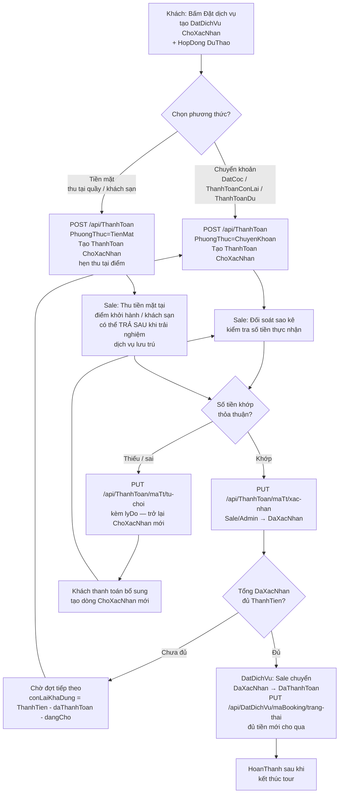

# QUY TRÌNH NGHIỆP VỤ THANH TOÁN — HỆ THỐNG TOUR DU LỊCH (mock, không liên kết ngân hàng)

> Trạng thái thanh toán trong code sau Prompt 4: `ChoXacNhan → DaXacNhan | TuChoi`, dữ liệu cũ `ThanhCong` được tính như `DaXacNhan`. Tổng hợp tiền: `daThanhToan = SUM(SoTien WHERE TrangThai IN (DaXacNhan, ThanhCong))`, `dangCho = SUM(SoTien WHERE ChoXacNhan)`, `conLai = ThanhTien - daThanhToan`, `conLaiKhaDung = ThanhTien - daThanhToan - dangCho`.

## Sơ đồ BPMN (mermaid)

Nguồn file mermaid: `docs/QUY-TRINH-THANH-TOAN.md` (chính file này). Để có file `.bpmn` chuẩn Camunda, import mermaid trên vào https://mermaid.live rồi export, hoặc mở PR riêng.

## Quy tắc chi tiết

1. **Tạo thanh toán:** chỉ KhachHang sở hữu booking được `POST`; `SoTien > 0`; `LoaiThanhToan ∈ {DatCoc, ThanhToanConLai, ThanhToanDu}`; `PhuongThuc ∈ {ChuyenKhoan, TienMat}`; chặn `SoTien > conLaiKhaDung`.
2. **Xác nhận/từ chối:** chỉ `Sale,Admin` được `PUT .../xac-nhan` / `.../tu-choi`; chỉ dòng `ChoXacNhan` mới được chuyển; booking `DaHuy` không được xác nhận; xác nhận không được làm `daThanhToan + SoTien > ThanhTien`.
3. **Nhiều đợt:** mỗi đợt là một dòng `ThanhToan` cùng `MaBooking`; không giới hạn số đợt; `GET .../tong-hop` trả cả `daThanhToan`, `dangCho`, `conLai`, `conLaiKhaDung` để FE hiển thị đúng.
4. **Tiền mặt trả sau:** với dịch vụ lưu trú/dịch vụ ngoài tour, cho phép tạo `ChoXacNhan` với `TienMat` và Sale xác nhận SAU khi khách đã trải nghiệm — không chặn theo thời gian tour, chỉ chặn khi booking đã `DaHuy`.
5. **Thực tế hệ thống hiện nay:** không có VNPay/MoMo, không có webhook ngân hàng — mọi xác nhận là thao tác thủ công của Sale (giả định Sale kiểm sao kê/thu tiền mặt). Ghi rõ mock này trong báo cáo đồ án.

## API liên quan sau sửa

- `POST /api/ThanhToan` → `201 { ChoXacNhan }`
- `PUT /api/ThanhToan/{maTt}/xac-nhan` `[Sale,Admin]` → `DaXacNhan`
- `PUT /api/ThanhToan/{maTt}/tu-choi` `[Sale,Admin]` → `TuChoi`
- `GET /api/ThanhToan/theo-booking/{maBooking}/tong-hop` → `{ tongTien, daThanhToan, dangCho, conLai, conLaiKhaDung }`
